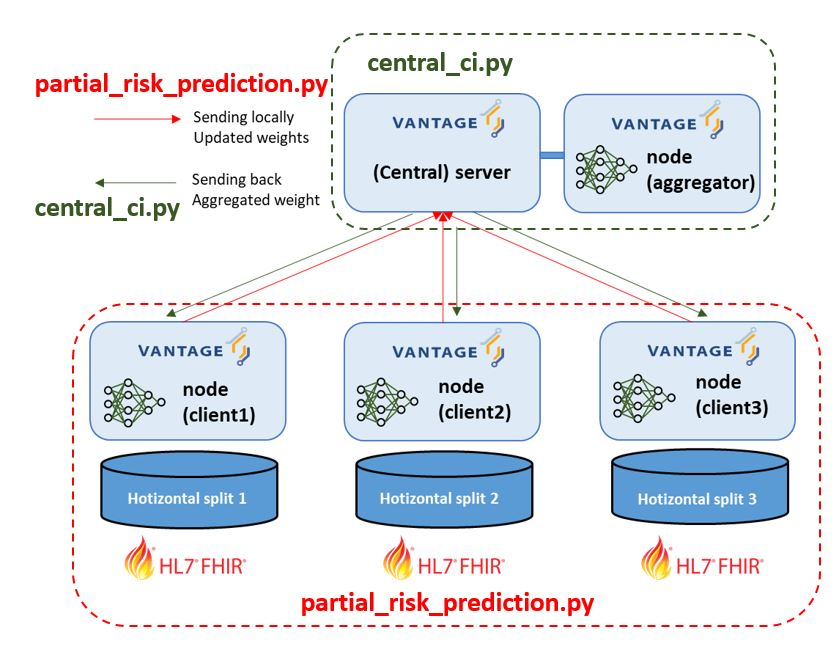

Implementation
==============

Overview
--------
The implementation of our federated learning on Vantage6 comprises the following four python scripts (plus on for performance evaluation):

- central_ci.py: Central part of the algorithm, this script is responsible for the orchestration and aggregation of the algorithm; it also includes the creation of subtasks for all the client nodes.
- partial_risk_prediction.py: Decentral part of the algorithm, this script works for local training followed by returning local weights to the server; it performs the subtasks created in the above cetral script.
- utils.py: Python script for common functions for Partials and performance evaluation.
- networks.py: Python script for creating CVD risk prediction models which is a neural network (based on the python implementation of DeepSurv)
- datasets.py: Python script for some functions for preparing "Dataset" data primitive of PyTorch

Central (``central``)
-----------------
The central part is responsible for the orchestration and aggregation of the algorithm.
The central part of the algorithm is defined in the function "central_ci". This function contains the following input variables:
    
    | predictor_cols: a python list of selected predictors after further data preparation step by "data_prep.py" from the harmonized FHIR data,

    | outcome_cols: a python list of outcome variables after further data preparation step by "data_prep.py" from the harmonized FHIR data, it should contrain 'LENFOL'(length of follow-up) and 'FSTAT' (event occurence),

    | dl_config: hyperparameter values regarding a neural network architecture and its training (specified in the configuration ini file),

    | num_update_iter: the number of aggregation iterations (set to 20 in our PoC),

    | n_fold: the number of folds in the data splitting in each client for train/valid/test(set to 10 in our PoC),

    | (optional) fold_index: the index of the fold that will be used for test (it is for the corrected resampled t-test in the performance evaluation)
    

First it gets all organizations (ids) within the collaboration so you can send a task to them.
Then, it starts the iterations of broadcasting weights/local weight updating/sending back/aggregation, by defining input parameters for a subtask (will be performed by the partial function below) and creating a subtask for all organizations in the collaboration.
After creating the subtask, it waits until obtain the results (the local model weight in our case) from all the client nodes. 
Finally, it computes an weighted average of the collected model weights; this weighted average is based on the trained weight of each local model and the number of training samples in each client node. 
The aggregated weight is then broadcasted to all the client at the beginning of the next iteration.

Partials
--------
Partials are the computations that are executed on each node. The partials have access
to the data that is stored on the node. The partials are executed in parallel on each
node.

The decentral part of the algorithm is defined in the function "partial_risk_prediction". This function contains the following input variables:
    
    | predictor_cols: a python list of selected predictors after further data preparation step by "data_prep.py" from the harmonized FHIR data,

    | outcome_cols: a python list of outcome variables after further data preparation step by "data_prep.py" from the harmonized FHIR data, it should contrain 'LENFOL'(length of follow-up) and 'FSTAT' (event occurence),

    | dl_config: hyperparameter values regarding a neural network architecture and its training (specified in the configuration ini file),

    | avged_params: the weighted averaged (aggregated and broadcasted by the server) model weight,

    | update_iter: the index of the current of aggregation iterations (to monitoring the progress)

    | n_fold: the number of folds in the data splitting in each client for train/valid/test(set to 10 in our PoC),
    
    | (optional) fold_index: the index of the fold that will be used for test (it is for the corrected resampled t-test in the performance evaluation)
    

The partial function starts with missing predictor data imputation (as such, data imputation independently on each client node). 
Then, it horizontally splits the local data into 80%/10%/10% for training/validation/test. 
Those are vertically partitioned into X (feature), e (FSTAT), y(LENFOL). We then apply min-max normalization (as such, again, data normalization independently on each client node).
After the data preparation for training the prediction model, it generate a PyTorch network and loads the aggregated weight received from the server.
We then start the training loop of the network. After the training, the trained model makes risk predictions on the test data.
Finally, it returns the following results of the subtask (i.e., the local training) to the vantage6 server:

    | params: json serialized form (to be sent to vantage6 server) of model parameters (i.e., model weights) after the local training; it is required for weighted averaging of model weight on the server,

    | num_train_samples: the number of training samples used for the local training; it is required for weighted averaging of model weight on the server,

    | test_cm: json serialized form of python dictionary including prediction results on the test data; 'risk_pred' (network output), 'y' (ground truth followup length for evaluation), 'e' (ground truth event occurence for evaluation)

    | test_eval: json serialized form of python dictionary including local model preformance evaluation results (i.e., the value of C-statistic)

